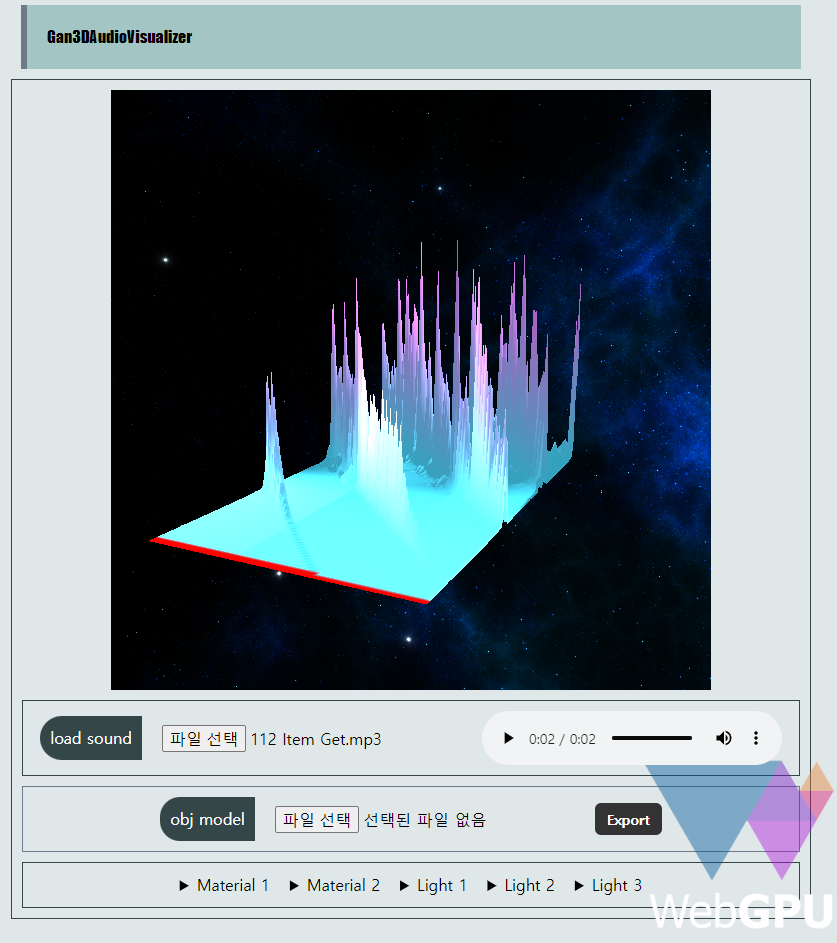

# Gan3DAudioVisualizer

WebGPU를 활용하여 음성을 3D모델로 변환하는 렌더링하는 프로젝트

## 음성분석 및 메시 생성

 음성 분석은 `AudioFileAnalyser`클래스에서 입력된 음성 파일의 [amplitudespectrum](https://meyda.js.org/audio-features#amplitudespectrum)값을 추출하여 수행됩니다. 이 작업은 Js의 Audio 라이브러리인 [Meyda](https://meyda.js.org/)를 이용하여 구현되어 있습니다. 이를 이용하여 각 주파수 분포에 대한 진폭값을 읽어와 생성될 메시의 높이값으로 사용하고 있습니다.

## Resources

[space-skyboxes](https://opengameart.org/content/space-skyboxes-0) 

## 도움!

[AdorableCSS](https://developer-1px.github.io/adorable-css/)
